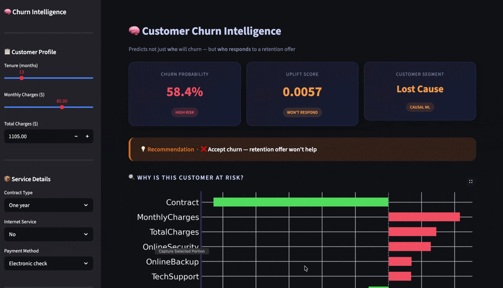

# 🔄 Customer Churn MLOps

> Predicts not just **who** will churn — but **who will actually respond** to a retention offer.  
> Built with causal inference, SHAP explainability, and a production FastAPI backend.
> 

---

## 🏆 Key Results

| Metric | Value |
|--------|-------|
| AUC-ROC Score | **0.8186** |
| Retention budget saved | **$52,500 (56.2%)** |
| Persuadable customers identified | **819 / 1,869 churners** |
| API response | **< 100ms** |

---

## 🧠 What Makes This Different

Most churn projects stop at "this customer will churn." This one goes further:

1. **Predicts churn probability** using XGBoost + SMOTE
2. **Explains why** using SHAP values — per customer, not just globally
3. **Identifies who responds to offers** using causal uplift modeling (T-Learner)
4. **Recommends an action** — discount, ignore, or don't disturb
5. **Serves everything via a REST API** with a single `/predict` call

---

## 🏗 Architecture

```
Raw Telco CSV (7,043 customers)
        ↓
Data Cleaning + Feature Engineering
(fix TotalCharges dtype, LabelEncoding, SMOTE)
        ↓
XGBoost Classifier ──────→ SHAP Explainability
(AUC-ROC: 0.8186)           (global + per-customer)
        ↓
MLflow Experiment Tracking
        ↓
Uplift Model (T-Learner, causalml)
        ↓
Customer Segmentation
┌─────────────┬──────────────┬─────────────┬───────────────┐
│ Persuadable │  Sure Thing  │ Lost Cause  │ Sleeping Dog  │
│  819 users  │  1,325 users │ 1,050 users │  3,838 users  │
└─────────────┴──────────────┴─────────────┴───────────────┘
        ↓
FastAPI REST API → /predict endpoint
```

---

## 📡 API Usage

**Endpoint:** `POST /predict`

**Request:**
```json
{
  "tenure": 3,
  "MonthlyCharges": 85.5,
  "TotalCharges": 256.5,
  "Contract": 0,
  "InternetService": 2,
  "gender": 1,
  "SeniorCitizen": 0,
  "Partner": 0,
  "Dependents": 0,
  "PhoneService": 1,
  "MultipleLines": 0,
  "OnlineSecurity": 0,
  "OnlineBackup": 0,
  "DeviceProtection": 0,
  "TechSupport": 0,
  "StreamingTV": 0,
  "StreamingMovies": 0,
  "PaperlessBilling": 1,
  "PaymentMethod": 2
}
```

**Response:**
```json
{
  "churn_probability": 0.8685,
  "uplift_score": -0.0995,
  "segment": "Persuadable",
  "recommendation": "🎯 Offer 20% discount immediately",
  "top_reasons": ["Contract", "MonthlyCharges", "InternetService"]
}
```

---

## 💰 Causal Inference — The Business Impact

Standard churn models waste money by offering discounts to everyone at risk.  
Uplift modeling identifies the **4 customer types** that matter:

| Segment | Description | Action |
|---------|-------------|--------|
| ✅ **Persuadable** | High churn risk + responds to offer | Target immediately |
| 😐 **Sure Thing** | Low churn risk anyway | No action needed |
| ❌ **Lost Cause** | High churn risk, won't respond | Accept the loss |
| ⚠️ **Sleeping Dog** | Low risk but offer might backfire | Do not contact |

**Result:** Targeting only Persuadables saves **$52,500 (56.2%)** of retention budget vs targeting all churners.

---

## 📊 EDA Insights

- **Contract type** is the #1 churn driver — month-to-month customers churn at **42%** vs **3%** for two-year contracts
- **Fiber optic** customers churn at **~40%** — highest of any internet service type
- **Short tenure** = high churn — majority of churners leave within the first **10 months**
- **Higher monthly charges** correlate strongly with churn

---

## 🛠 Tech Stack

| Layer | Tools |
|-------|-------|
| Data Processing | Pandas, NumPy, scikit-learn |
| Class Imbalance | SMOTE (imbalanced-learn) |
| ML Model | XGBoost |
| Causal Inference | causalml (T-Learner) |
| Explainability | SHAP |
| Experiment Tracking | MLflow |
| API | FastAPI + Uvicorn |
| Notebooks | Google Colab |

---

## 🗂 Project Structure

```
customer-churn-mlops/
│
├── notebooks/
│   ├── 01_eda.ipynb          # EDA, cleaning, modeling, SHAP
│   ├── 02_uplift.ipynb       # Causal inference, segmentation
│   └── 03_api.ipynb          # FastAPI app + live testing
│
├── data/
│   └── WA_Fn-UseC_-Telco-Customer-Churn.csv
│
├── models/
│   ├── churn_model.pkl
│   ├── uplift_model.pkl
│   └── feature_names.pkl
│
└── README.md
```

---

## 🚀 Run Locally

```bash
# Clone the repo
git clone https://github.com/YOUR_USERNAME/customer-churn-mlops.git
cd customer-churn-mlops

# Create virtual environment
python3 -m venv venv
source venv/bin/activate

# Install dependencies
pip install -r requirements.txt

# Run the API
uvicorn app.main:app --reload

# Test the endpoint
curl -X POST http://localhost:8000/predict \
  -H "Content-Type: application/json" \
  -d '{"tenure": 3, "MonthlyCharges": 85.5, ...}'
```

---

## 📈 Model Performance

| Model | AUC-ROC | F1 (Churn) | Precision | Recall |
|-------|---------|------------|-----------|--------|
| XGBoost + SMOTE | **0.8186** | 0.58 | 0.54 | 0.61 |

---

## 🔮 Future Improvements

- [ ] Streamlit dashboard with real-time predictions
- [ ] Docker containerization + Railway deployment
- [ ] Model drift detection with Evidently AI
- [ ] Survival analysis — predict *when* customers will churn
- [ ] A/B test simulator for retention offer strategies

---

## 👤 Author

**Chirag Batra**  
B.Tech Computer Science (Data Science) 
[GitHub](https://github.com/YOUR_USERNAME) · [LinkedIn](https://linkedin.com/in/YOUR_PROFILE)

---

*Built as part of a data science portfolio project targeting production-grade ML engineering.*
